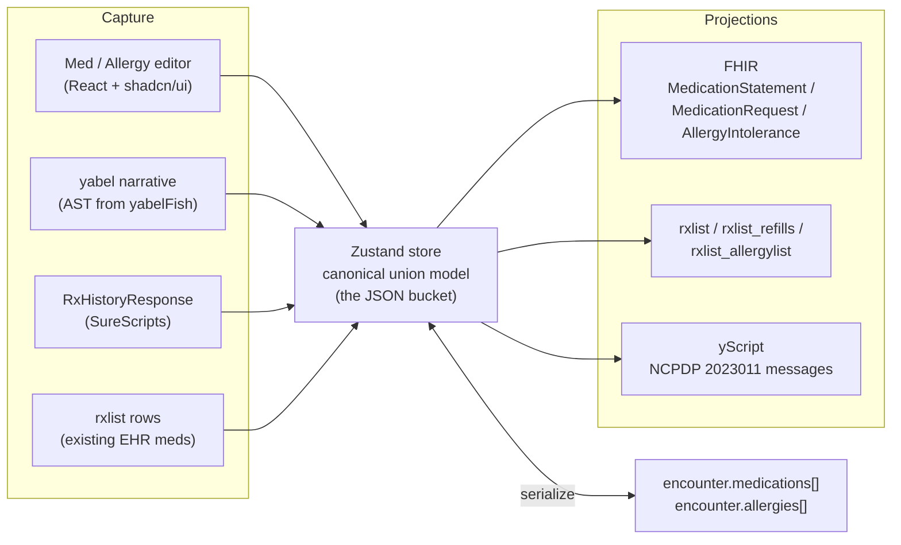
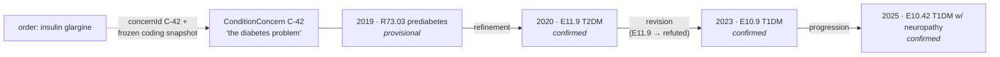
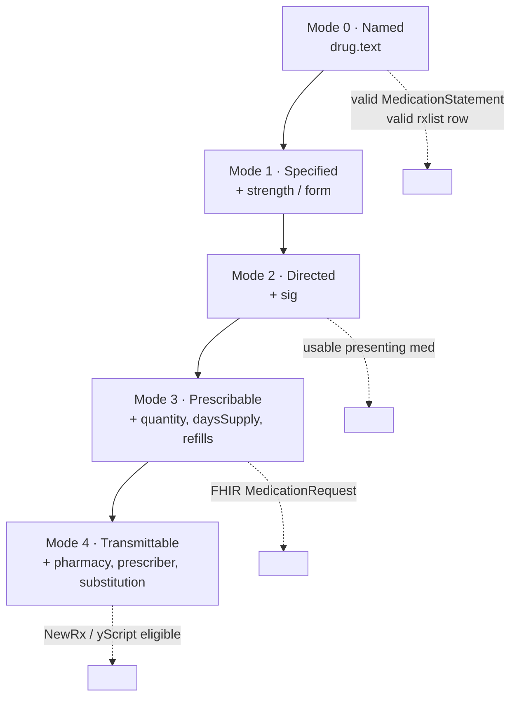

# Medication, Allergy & Condition Model — Implementation Plan

**Status:** Draft for developer review
**Scope:** A JSON medication/allergy/condition bucket on the encounter, a Zustand store to edit it, and UI for a med list + med/allergy editors + problem-list surfaces. Supports the full fidelity spectrum from *name-only* to *fully transmittable prescription*, captures uncertainty explicitly, models condition evolution (concern vs. assertion, §3.4), and serializes to **yabel**, **FHIR**, and our internal **`rxlist`** by unioning their requirements into one canonical model.

---

## 1. The problem in one paragraph

A clinician reviewing meds at an encounter almost never has uniform information. For one drug they have a full prescription (drug, sig, quantity, refills, pharmacy); for the next they have a name a patient mumbled and nothing else ("something for blood pressure, a water pill"). Today we force that into schemas — `rxlist`, FHIR, NCPDP — that were each designed for a *different* downstream purpose and each assume a *different* minimum completeness. The result is that partial knowledge either gets dropped or gets faked to satisfy a required field. This plan makes partial knowledge and uncertainty **first-class**, stores it once, and projects it out to whichever representation a consumer needs.

The central design move: **one canonical record that is the *union* of what yabel, FHIR, and `rxlist` each need.** Editing happens against the canonical record. Each target format is a *projection* with its *own* required-field subset. A record is never globally "invalid" — it is only "not yet complete enough for target T."

---

## 2. Architecture



The Zustand store *is* the JSON bucket while editing; it serializes to `encounter.medications[]` / `encounter.allergies[]` for persistence. Everything else — FHIR, `rxlist`, yScript — is a pure function of the canonical record.

---

## 3. The canonical data model

TypeScript sketches below are illustrative — field names should be frozen against the real `rxlist` DDL and the 2023011 XSD before implementation (see §11).

### 3.1 Medication record

```ts
interface MedicationRecord {
  // ---- identity & lineage ----
  id: string;                        // canonical, store-stable uuid
  refs: {
    instanceRef?: string;            // yabel  #med-1023
    rxid?: number;                   // rxlist.rxid
    refillId?: number;               // rxlist_refills.refill_id
    fhirId?: string;
    extId?: string;                  // rxlist.ext_id (e.g. SureScripts id)
  };
  supersedes?: string;               // canonical id of the record this one replaces
  changeType?:                       // why it superseded (drives yScript decomposition)
    | 'dose_change' | 'therapy_substitution'
    | 'formulation_change' | 'frequency_change' | null;

  // ---- what it is ----
  drug: {
    text: string;                    // free-text name — the ONLY hard-required field (Mode 0)
    coding: Coding[];                // RxNorm / NDC / SNOMED
    drugId?: number;                 // rxlist.drug_id (internal library)
    medicationId?: number;           // rxlist.medication_id
    uncodedType?: 'CP' | 'SP' | null;// compound / supply
  };
  strength?: string;                 // "20 MG"  (rxlist.strength)
  form?: string;
  route?: { text?: string; routeId?: number };

  // ---- how to take it ----
  sig?: {
    text?: string;                   // provider directions (rxlist.sig)
    patientText?: string;            // plain-language (rxlist.sig_patient)
    structured?: unknown;            // FHIR Dosage / NCPDP codified sig — STUB, see §11
  };
  instructions?: string;             // rxlist.instructions
  indication?: IndicationLink & { text?: string };  // durable concern link + frozen coding (§3.4);
                                                     // text-only when no concern exists yet

  // ---- dispense / prescription layer (upper rungs of the ladder) ----
  dispense?: {
    quantity?: { value: number; unit?: string };  // total_quantity / qty_uom
    daysSupply?: number;                            // duration
    refills?: number;                               // refills
    maySubstitute?: boolean;                        // may_substitute
  };
  pharmacy?: { ncpdpId?: string; name?: string };
  prescriber?: { npi?: string; name?: string; id?: number };

  // ---- when ----
  period?: {
    start?: string;  startFuzzy?: string;  // rxlist start_date / start_date_fuzzy
    end?: string;    endFuzzy?: string;     // rxlist end_date / end_date_fuzzy
  };

  // ---- status & provenance ----
  status: MedStatus;
  source: 'rxHistoryResponse' | 'ehrActive' | 'patientReported' | 'manuallyAdded';
  review: 'unreviewed' | 'confirmed' | 'reconciledIntoEhr' | 'discrepancy' | 'ignored';

  // ---- uncertainty (first-class, see §4) ----
  uncertainty: Uncertainty;

  // ---- audit (mirrors rxlist revision columns) ----
  audit?: { enteredDate?: string; revisionDate?: string; revisionNo?: number; alterReason?: string };
}

type Coding = { system: 'RxNorm' | 'NDC' | 'SNOMED' | string; code: string; display?: string };
```

### 3.2 Canonical status enum

One enum, projected both ways. `changed` and `noMeds` are the ones that don't map cleanly to FHIR and need care.

| Canonical `MedStatus` | `rxlist.status` | FHIR `MedicationStatement.status` | Notes |
|---|---|---|---|
| `active` | `1` | `active` | |
| `discontinued` | `2` | `stopped` | |
| `changed` | `3` | `completed` + `supersedes` | superseded by a newer record |
| `dispensed` | `-2` | `active` | |
| `reconciled` | `-3` | `active` | reconciled from external history |
| `deleted` | `-1` | `entered-in-error` | |
| `noMeds` | `4` | *(negative assertion, §4.4)* | "no medications" marker |
| `intended` | *(n/a)* | `intended` | planned, not yet started |

### 3.3 Allergy record

Parallel structure; reuses the same `Uncertainty` block.

```ts
interface AllergyRecord {
  id: string;
  refs: { rxagyid?: number; fhirId?: string; extId?: string };
  substance: {
    text: string;                    // hard-required (Mode 0 analog)
    coding: Coding[];
    allergyId?: number;              // rxlist_allergylist.allergy_id
    agyidType?: number;              // agyid_type
  };
  type: 'allergy' | 'intolerance';   // rxlist intolerance 0 / 1
  reactions: Array<{                 // rxlist reaction/reaction_severity + rxlist_allergy_reactions
    manifestation?: string;
    severity?: 'mild' | 'moderate' | 'severe';
  }>;
  criticality?: 'low' | 'high' | 'unable-to-assess';        // FHIR
  clinicalStatus: 'active' | 'inactive' | 'resolved';        // FHIR
  verificationStatus:
    | 'unconfirmed' | 'confirmed' | 'refuted' | 'entered-in-error';  // FHIR + rxlist status
  period?: { start?: string; end?: string };
  comments?: string;
  uncertainty: Uncertainty;
}
```

### 3.4 Conditions — concern vs. assertion

**Developer primer — why conditions can't be modeled like meds.** Coded conditions *drift*: "prediabetes" becomes "type 2 diabetes" becomes — after a C-peptide test — "type 1 diabetes, actually", which later becomes "T1DM with neuropathy." Every downstream schema that treats **the code as the identity of the condition** breaks when this happens. The status-quo workaround — stamping an ICD-10 code onto each prescription and joining orders to problems *by code* in billing — decays exactly this way: recode the problem and every historical link silently unhooks.

The fix is the classic concern-tracking pattern (openEHR / C-CDA Concern Act): split the model into

- a **`ConditionConcern`** — the *stable identity* of "this patient's diabetes problem." It has a durable `concernId`, and **this is the only thing orders, encounters, and other records ever reference.** It never changes meaning; it only accumulates history.
- a series of **`ConditionAssertion`s** — time-stamped, coded characterizations of the concern. *These* carry the ICD-10/ICD-11/SNOMED codings, the verification status, severity, etc. When understanding evolves, we append a new assertion; we never rewrite an old one.



```ts
interface ConditionConcern {
  concernId: string;                 // durable uuid — the ONLY id other records reference
  refs: { problemId?: number; fhirId?: string; extId?: string };  // freeze against real problem-list DDL
  clinicalStatus: 'active' | 'recurrence' | 'relapse' | 'inactive' | 'remission' | 'resolved';
  assertions: ConditionAssertion[];  // ordered; last non-refuted = current characterization
  relationships?: Array<{
    type: 'caused-by' | 'evolved-from' | 'differential-sibling' | 'complication-of';
    concernId: string;
  }>;
  source: 'ehrProblemList' | 'patientReported' | 'manuallyAdded' | 'claimsHistory';
  review: 'unreviewed' | 'confirmed' | 'reconciledIntoEhr' | 'discrepancy' | 'ignored';
  comments?: string;
}

interface ConditionAssertion {
  id: string;
  supersedes?: string;               // prior assertion id (same machinery as med supersedes, §3.1)
  changeType?:                       // why it superseded
    | 'refinement'                   // more specific, same disease (dementia → ischemic dementia)
    | 'revision'                     // prior was wrong; prior becomes verificationStatus 'refuted' (T2DM → T1DM)
    | 'progression'                  // disease advanced (T1DM → T1DM w/ neuropathy)
    | 'reattribution'                // root cause re-assigned; usually pairs with a 'caused-by' relationship
    | null;

  // ---- what it is (at this point in time) ----
  condition: {
    text: string;                    // free-text name — the ONLY hard-required field (Mode 0 analog)
    coding: ConditionCoding[];       // ICD-10 / ICD-11 / SNOMED — zero or more, may coexist
  };
  category?: 'problem-list-item' | 'encounter-diagnosis' | 'health-concern';
  verificationStatus:
    | 'unconfirmed' | 'provisional' | 'differential'
    | 'confirmed' | 'refuted' | 'entered-in-error';   // FHIR Condition.verificationStatus
  severity?: 'mild' | 'moderate' | 'severe';
  bodySite?: { text?: string; coding?: Coding[] };     // SNOMED body-structure codes
  laterality?: 'left' | 'right' | 'bilateral';         // ICD-10/11 often encode this in the code itself

  // ---- when ----
  onset?: { date?: string; fuzzy?: string };           // same fuzzy pattern as meds (§4.2)
  abatement?: { date?: string; fuzzy?: string };
  effectivePeriod: { start: string; end?: string };    // when this WAS the characterization (trend axis)

  // ---- provenance ----
  encounterId?: string;              // where this assertion was made
  uncertainty: Uncertainty;
  comments?: string;
}

type ConditionCoding = Coding & {
  system: 'ICD-10-CM' | 'ICD-11' | 'SNOMED' | string;
  primary?: boolean;                 // which coding is authoritative for this assertion
  mappedFrom?: string;               // provenance when derived via a crosswalk (e.g. SNOMED→ICD-10 map)
};
```

Coding-system notes:

| System | FHIR `system` URI | Role | Notes |
|---|---|---|---|
| ICD-10-CM | `http://hl7.org/fhir/sid/icd-10-cm` | Billing / claims | Laterality & episode baked into the code; US claims still require it. |
| ICD-11 (MMS) | `http://id.who.int/icd/release/11/mms` | Forward compatibility / international | Supports post-coordination (stem + extension codes) — store the full cluster string in `code`. |
| SNOMED CT | `http://snomed.info/sct` | Clinical semantics | Preferred `primary` coding; richest for decision support and maps *out* to both ICD revisions. |

**Refinement vs. revision — the two kinds of change are semantically different:**

| Change | Example | Operation | Prior assertion becomes |
|---|---|---|---|
| **Refinement** | dementia → ischemic dementia | new assertion, `changeType: 'refinement'` | superseded (was true-as-known) |
| **Revision** | differential T2DM → actually T1DM | new assertion, `changeType: 'revision'` | **`refuted`** (was never true) |
| **Progression** | T2DM → T2DM w/ neuropathy | new assertion, `changeType: 'progression'` | superseded |
| **Re-attribution** | "dementia" → caused by cerebrovascular disease | new assertion + `caused-by` relationship to a (possibly new) concern | superseded |

The classification is mostly mechanical via the SNOMED **is-a** hierarchy: if the new code is an is-a *descendant* of the old (vascular dementia is-a dementia) it's a refinement; if it's a *sibling or disjoint branch* (T1DM vs T2DM are siblings under diabetes mellitus) it's a revision. The UI uses this to *suggest* the `changeType` at write time — the terminology tree classifies transitions, it is **not** used to reverse-engineer linkage at read time.

**Order linkage — reference + frozen snapshot, always both.** A prescription's (or any order's) indication carries three things:

```ts
interface IndicationLink {
  concernId: string;                 // durable clinical link — survives any recoding
  assertionId?: string;              // which characterization was current when ordered
  coding?: ConditionCoding[];        // FROZEN snapshot for billing/audit — a projection, never the join key
}
```

`concernId` answers "what problem is this med for?" forever — the join can't decay because the identity isn't the code. The frozen `coding` answers "what did we believe/bill at the time?" forever — honest history even after a revision. The ICD-10 that lands on the claim is a **point-in-time projection** (§8) of the concern's current assertion at transaction time; the claim is *supposed* to be a snapshot, the EHR just must never use the claim's code as its own join key.

**Trending without lying** — two query paths:

1. **Clinical story:** walk the assertion chain (`supersedes` + `changeType`). "First noted 2019 as prediabetes, revised to T1DM 2023, neuropathy 2025" falls straight out — no inference needed.
2. **Cohorts / analytics:** query assertions by `effectivePeriod`, aggregate via SNOMED is-a *descendants* ("any descendant of 73211009 diabetes mellitus active in 2024") so refinements don't drop patients from cohorts, and exclude `refuted` assertions so revisions don't pollute the trend.

Terminology inference (is-a traversal) is used to **suggest links at capture time** and **narrate/roll up at read time** — never as the system of record for linkage. Explicit skeleton, inferred flesh.

Design rules mirroring the med model:

- **Capture-first.** "high blood pressure" saves instantly as a text-only assertion on a new concern; coding is progressive enrichment via terminology autocomplete (SNOMED-first, ICD-10/ICD-11 derived through published crosswalks where the map is 1:1 — ambiguous maps surface a picker, never auto-select).
- **Uncertainty applies.** `verificationStatus: 'provisional' | 'differential'` covers diagnostic uncertainty; the shared `uncertainty.fields` block covers field-level softness (fuzzy onset — "since her twenties").
- **Round-trip preservation.** Codings the store did not originate pass through untouched; `mappedFrom` records crosswalk provenance so a re-map never silently overwrites a hand-picked code.
- **Negative assertion.** `noKnownProblems` on the bucket (§4.4) parallels NKDA — FHIR export uses SNOMED `160245001` (no current problems or disability).

FHIR projection: concern → `Condition` (logical id = `concernId`), each assertion → a `Condition` version + `Provenance`; `IndicationLink` → `MedicationRequest.reasonReference`.

### 3.5 Encounter scope & the three problem surfaces

Conditions live on **two levels** that must not be conflated: the **patient-level problem list** (longitudinal concerns, the holistic record) and the **encounter-level view** of those concerns. A cardiologist neither wants nor should be forced to curate the patient's psoriasis — they maintain a *Relevant* Problem List. The model must let them do that **without their encounter being misread as a holistic review** ("the cardiologist didn't mention psoriasis, so it must be resolved" is exactly the inference we must make impossible).

Three UI surfaces, one data spine:

| Surface | Level | Contents | Component (§9) |
|---|---|---|---|
| **Problem List** | patient | all `ConditionConcern`s, full assertion history | `<ProblemList>` |
| **Presenting Problems** (Medical History) | encounter | *references* to concerns deemed relevant this visit + ad-hoc additions | `<PresentingProblems>` |
| **Assessment (& Plan)** | encounter | today's assertion per addressed concern, with orders nested under each problem | `<Assessment>` |

```ts
interface EncounterConditions {
  scope: 'problem-focused' | 'comprehensive';   // chosen by the provider at encounter start

  // concerns touched this visit — new ones, or copies of patient concerns being edited
  concerns: ConditionConcern[];

  // Presenting Problems / Relevant Medical History — references, not copies
  presenting: Array<{
    concernId: string;
    relevance: 'addressed' | 'relevant-history' | 'noted';  // tag lives on the REFERENCE,
    comments?: string;                                       // never on the concern itself
  }>;

  // Assessment & Plan — visit-specific
  assessment: Array<{
    concernId: string;
    assertionId: string;             // today's assertion (even a no-change "addressed today" one)
    orders: Array<{
      orderId: string;               // med / lab / procedure — renders indented under the problem
      type: 'medication' | 'lab' | 'imaging' | 'procedure' | 'referral';
    }>;
    note?: string;
  }>;

  noKnownProblems: boolean;          // only assertable when scope === 'comprehensive'
}
```

Key semantics:

- **Relevance lives on the reference, not the concern.** "Relevant to my specialty" is an encounter-scoped judgment; it must never pollute the patient-level record or another specialist's view.
- **Presenting Problems is fed by the Problem List.** The default flow is *select* from patient concerns (+ relevance tag); ad-hoc capture-first additions create a new concern in `concerns` and a reference in `presenting`.
- **Every assessed problem gets a per-visit assertion.** Even "no change, addressed today" appends a lightweight assertion (same coding, new `effectivePeriod`) — this gives trending an honest per-visit data point and makes the billing projection (assessed problems → claim diagnoses) trivial.
- **Assessment & Plan nesting** is pure `IndicationLink` traversal: orders carrying `concernId` X render indented under problem X; orders with no link render in an "unlinked" bucket the UI nags about.

**Encounter close — scope gates the merge.** When the encounter closes, `EncounterConditions` is merged into the patient object by a projection (§8) whose behavior the `scope` flag switches:

| On close | `comprehensive` | `problem-focused` |
|---|---|---|
| Touched concerns (new assertions, status changes) | upsert into patient problem list | upsert into patient problem list |
| Untouched patient concerns | may be marked reviewed / resolved / refuted as part of full reconciliation | **left strictly untouched** |
| Negative assertions (`noKnownProblems`) | allowed | **forbidden** — absence of mention asserts nothing |
| Patient-level "last full review" timestamp | updated | not updated |

This is the condition-side instance of the doc's core rule: **we never block capture — we gate projection.** A problem-focused encounter captures exactly what the specialist attended to; the close projection guarantees that partial attention is never inflated into a holistic claim.

---

## 4. Uncertainty as a first-class citizen

This is the requirement that most schemas get wrong. Uncertainty is multi-dimensional, so we model it explicitly rather than smuggling it into free-text notes.

```ts
interface Uncertainty {
  overall: 'confirmed' | 'low' | 'medium' | 'high';
  adherence: 'taking' | 'not-taking' | 'unsure' | 'unknown';
  verification: 'unverified' | 'patient-reported' | 'pharmacy-verified' | 'prescriber-confirmed';
  fields: Partial<Record<UncertainField, FieldUncertainty>>;
}

interface FieldUncertainty {
  known: boolean;
  reason?: 'asked-unknown' | 'not-asked' | 'masked' | 'unavailable';  // ~ FHIR data-absent-reason
  confidence?: 'low' | 'medium' | 'high';
  note?: string;                     // "patient thinks 20 but not sure"
}

type UncertainField = 'strength' | 'sig' | 'form' | 'route' | 'period' | 'indication' | 'dispense';
```

### 4.1 The three-state rule for every field

The single most important semantic in the whole design. Any optional field has **three** distinct states the UI and model must keep separate:

| State | Value | `fields[x]` flag | Meaning |
|---|---|---|---|
| **Confident** | set | absent | We know it. |
| **Uncertain** | set | `{ known: true, confidence: 'low', note }` | We have a value but flag it as soft. |
| **Explicitly unknown** | *empty* | `{ known: false, reason: 'asked-unknown' }` | We asked; patient doesn't know. |
| **Untouched** | *empty* | absent | Not yet entered. **≠ unknown.** |

"Blank" must never silently mean "unknown." The clinician has to be able to *assert* unknown (which is clinically meaningful — "I asked, they don't know the dose") distinctly from not having gotten to the field yet. This is the crux of "capture uncertainty."

### 4.2 Temporal fuzziness — we already have the columns

`rxlist` carries `start_date` **and** `start_date_fuzzy` (same for end). Use them: `period.start` holds an exact ISO date when known; `period.startFuzzy` holds a partial/human string ("early 2024", "~3 months ago") when that's all the clinician has. FHIR export maps fuzzy values to `dataAbsentReason` + a note, or to a partial `dateTime` where the precision allows.

### 4.3 Existence vs. adherence uncertainty

`uncertainty.adherence` captures "patient says they were prescribed this but stopped taking it" (`not-taking`) or "not sure if still on it" (`unsure`) — orthogonal to whether the *record's fields* are known. `verification` captures source reliability, and doubles as the reconciliation confidence signal.

### 4.4 Negative assertions (NKDA / No Meds)

Absence of records is **not** the same as an asserted "none." Model these as explicit flags on the bucket so they round-trip:

```ts
interface MedBucket {
  medications: MedicationRecord[];
  allergies: AllergyRecord[];
  conditions: ConditionConcern[];    // patient-level; encounter-level lives in EncounterConditions (§3.5)
  noKnownMedications: boolean;   // → rxlist NOMEDS (status 4)
  noKnownAllergies: boolean;     // NKDA → FHIR AllergyIntolerance code SNOMED 716186003
  noKnownProblems: boolean;      // → FHIR Condition code SNOMED 160245001
}
```

Setting `noKnownAllergies` with allergy records present (or `noKnownProblems` with condition records present) is a validation conflict the UI must surface.

---

## 5. The fidelity ladder ("modes")

Modes are **derived**, not stored. `mode(record)` is a pure function of which fields are populated (counting "explicitly unknown" as *addressed*, not missing). The UI reads the current rung to decide which affordances to show and what's needed to climb.



| Mode | Adds | Enables | Example |
|---|---|---|---|
| 0 · Named | `drug.text` | presenting-list entry, statement | "lisinopril" |
| 1 · Specified | strength/form | coded matching | "lisinopril 10 mg tablet" |
| 2 · Directed | `sig` | usable MedicationStatement | "lisinopril 10 mg po daily" |
| 3 · Prescribable | quantity, days supply, refills | FHIR MedicationRequest | + "#30, 3 refills" |
| 4 · Transmittable | pharmacy, prescriber, substitution | **NewRx via yScript** | + "→ Walgreens #4021" |

The ladder is the gate on downstream capability: only a **Mode 4** record can generate a NewRx (this is exactly the yScript eligibility rule from the prior design). A Mode 2 record is a perfectly good presenting med but cannot transmit. **We never block capture on mode — we gate projection.**

---

## 6. The union field map

This is the heart of the "union the requirements" instruction and the part to review most carefully. Canonical field on the left; how each target consumes it; and the lowest mode at which the field is *required for that target*.

| Canonical | `rxlist` column | FHIR path | yabel node | Req. for target @ mode |
|---|---|---|---|---|
| `drug.text` | `drug_name` | `medication.text` | statement head | all @ 0 |
| `drug.coding[RxNorm]` | `medication_id` | `medicationCodeableConcept.coding` | coding hint | FHIR/NewRx @ 1 |
| `drug.drugId` | `drug_id` | *(ext)* | — | rxlist |
| `drug.uncodedType` | `uncoded_type` | *(ext)* | — | rxlist |
| `strength` | `strength` | part of coded product / `.text` | strength token | NewRx @ 1 |
| `route` | `route_id` | `dosage.route` | route token | — |
| `sig.text` | `sig` | `dosageInstruction.text` | sig line | statement @ 2, NewRx @ 2 |
| `sig.patientText` | `sig_patient` | `dosageInstruction.patientInstruction` | — | — |
| `sig.structured` | *(n/a)* | `dosageInstruction.timing/doseAndRate` | — | NewRx (codified) |
| `indication` | `indication` / `ind_code` / `ind_code_sys` | `reasonCode` | — | — |
| `instructions` | `instructions` | `note` | — | — |
| `dispense.quantity` | `total_quantity` / `qty_uom` | `dispenseRequest.quantity` | — | NewRx @ 3 |
| `dispense.daysSupply` | `duration` | `dispenseRequest.expectedSupplyDuration` | — | NewRx @ 3 |
| `dispense.refills` | `refills` | `dispenseRequest.numberOfRepeatsAllowed` | — | NewRx @ 3 |
| `dispense.maySubstitute` | `may_substitute` | `substitution.allowed` | — | NewRx @ 4 |
| `pharmacy` | *(refills/newrx)* | `dispenseRequest.performer` | — | NewRx @ 4 |
| `prescriber` | `doctor_id` | `requester` | — | NewRx @ 4 |
| `period.start` | `start_date` | `effectivePeriod.start` | timeline | — |
| `period.startFuzzy` | `start_date_fuzzy` | `dataAbsentReason` + note | timeline (fuzzy) | — |
| `status` | `status` | `.status` (see §3.2) | lifecycle | all |
| `source` | `interface` | `informationSource` | provenance hint | — |
| `refs.extId` | `ext_id` | `identifier` | — | — |
| `supersedes` | `changed_from_rxid` | `priorPrescription` / `basedOn` | `relatedTo` | — |
| `uncertainty.fields[x]` | *(none — new)* | `dataAbsentReason`, `.text` notes | inlay hint | — |

The gaps are informative: **`rxlist` has no home for structured per-field uncertainty** (only the fuzzy-date pair) — that's net-new state the canonical model adds and that only FHIR (via `dataAbsentReason`) partially absorbs on export. Conversely, `uncodedType` and `drugId` are `rxlist`-only and must be preserved as opaque passthrough so a round-trip through the store doesn't lose them.

Allergy map (condensed):

| Canonical | `rxlist_allergylist` | FHIR `AllergyIntolerance` |
|---|---|---|
| `substance.text` | `allergy_name` | `code.text` |
| `type` | `intolerance` (0/1) | `type` (allergy/intolerance) |
| `reactions[].manifestation` | `reaction` / `rxlist_allergy_reactions` | `reaction.manifestation` |
| `reactions[].severity` | `reaction_severity` | `reaction.severity` |
| `verificationStatus` | `status` | `verificationStatus` |
| `period` | `start_date` / `end_date` | `onset` / `lastOccurrence` |

---

## 7. Zustand store

### 7.1 Shape

```ts
interface MedStore {
  bucket: MedBucket;                 // the serializable JSON (§4.4)

  // mutations — meds
  addMed(partial: Partial<MedicationRecord>): string;    // returns id; Mode 0 is enough
  updateMedField<K extends keyof MedicationRecord>(id: string, key: K, val: MedicationRecord[K]): void;
  setFieldUnknown(id: string, field: UncertainField, reason: FieldUncertainty['reason']): void;
  setFieldConfidence(id: string, field: UncertainField, confidence: FieldUncertainty['confidence'], note?: string): void;
  setStatus(id: string, status: MedStatus): void;
  supersede(priorId: string, next: Partial<MedicationRecord>, changeType: MedicationRecord['changeType']): string;
  removeMed(id: string): void;

  // mutations — allergies
  addAllergy(partial: Partial<AllergyRecord>): string;
  updateAllergy(id: string, patch: Partial<AllergyRecord>): void;
  removeAllergy(id: string): void;

  // mutations — conditions (concern/assertion model, §3.4–§3.5)
  addConcern(assertion: Partial<ConditionAssertion>): string;   // new concern + first assertion; text-only OK
  assertCondition(concernId: string, next: Partial<ConditionAssertion>,
                  changeType: ConditionAssertion['changeType']): string;  // refine / revise / progress
  relateConcerns(fromId: string, type: 'caused-by' | 'evolved-from' | 'differential-sibling' | 'complication-of', toId: string): void;
  setConcernStatus(concernId: string, status: ConditionConcern['clinicalStatus']): void;
  setEncounterScope(scope: 'problem-focused' | 'comprehensive'): void;
  setPresenting(concernId: string, relevance: 'addressed' | 'relevant-history' | 'noted' | null): void;
  linkOrderToConcern(orderId: string, concernId: string): void;  // writes IndicationLink w/ frozen coding
  removeConcern(concernId: string): void;

  // negative assertions
  setNoKnownMedications(v: boolean): void;
  setNoKnownAllergies(v: boolean): void;
  setNoKnownProblems(v: boolean): void;

  // ingestion
  ingestRxlist(rows: RxlistRow[]): void;
  ingestHistory(resp: RxHistoryResponse): void;   // sets source='rxHistoryResponse', review='unreviewed'
  ingestYabelAst(ast: YabelAst): void;
}
```

### 7.2 Selectors (derived, memoized)

```ts
selectMode(id): 0|1|2|3|4                 // §5
selectCompleteness(id): { mode, missingForNext: string[] }
selectPresentingList(): MedicationRecord[]  // source-tagged review list
selectActive(): MedicationRecord[]
selectDiscrepancies(): MedicationRecord[]   // history vs ehrActive conflicts
selectTransmittable(): MedicationRecord[]   // mode === 4 && status in {active, changed}
selectValidationForTarget(id, target: 'fhir'|'rxlist'|'newrx'): Diagnostic[]
```

### 7.3 Middleware

- **immer** — ergonomic nested updates (the record is deep).
- **persist** — *decision required* (§11): PHI in browser storage is a policy call. Default recommendation: **do not** persist to `localStorage`; the encounter JSON is the server-side source of truth and the store hydrates from it per session.
- **zundo** (or equivalent) — undo/redo, and the natural place to emit `audit.revisionNo` increments that mirror `rxlist_revisions`.

### 7.4 Serialization to the encounter

`bucket` *is* `encounter.medications[]` + `encounter.allergies[]` + `encounter.conditions` (§3.5 `EncounterConditions`) + the negative-assertion flags. One `serialize()` / `hydrate()` pair; no transformation, because the canonical model is designed to be the on-disk bucket shape. Projections to FHIR/`rxlist`/yScript — and the scope-gated `closeEncounter` merge — are separate, on demand.

---

## 8. Projections (adapters)

Pure functions, each in its own module, each with its own required-field validation keyed to the mode ladder.

```
projections/
  toFhir.ts       record → MedicationStatement | MedicationRequest ; allergy → AllergyIntolerance ;
                  concern → Condition (id = concernId; assertions → versions + Provenance)
  toRxlist.ts     record → rxlist (+ rxlist_refills when mode ≥ 3)
  toYscript.ts    record → NCPDP 2023011 message(s)   [only mode 4; decomposes per changeType]
  closeEncounter.ts  EncounterConditions → patient problem-list merge   [behavior gated by scope, §3.5]
  fromRxlist.ts   rxlist row(s) → record
  fromHistory.ts  RxHistoryResponse entry → record (source-tagged)
  fromYabel.ts    yabel AST node → record
```

Two rules every projection obeys:

1. **Validate against the target's own minimum, not the store's.** `toYscript` throws/returns diagnostics if `mode < 4`; `toFhir` for a `MedicationStatement` accepts `mode 0`.
2. **Round-trip preservation.** `fromRxlist → toRxlist` must not lose `uncodedType`, `drugId`, `extId`, fuzzy dates, or the uncertainty block (the last has no `rxlist` home, so if the pipeline ever persists *only* to `rxlist`, uncertainty is dropped — flag this to product; it may argue for a sidecar table or keeping the bucket authoritative).

`toYscript` reuses the decomposition logic already specified: a `dose_change` supersede → **CancelRx** (prior) + **NewRx** (next); a `stop` → **CancelRx** only; a Mode-4 new med → **NewRx**.

---

## 9. UI components

Three surfaces, built on the shadcn/ui primitives already in use (segmented controls, auto-growing textareas, two-column layouts).

### 9.1 `<MedicationList>` — review surface

The "list of meds" view. Grouped by `status`, each row shows: name + strength, a **source badge** (RxHistory / EHR / patient-reported), a **completeness pip** (which rung on the ladder), and a **discrepancy flag** when history and EHR disagree. Rows expand into the editor. This is where reconciliation happens — confirm, ignore, or reconcile-into-EHR per row.

### 9.2 `<MedicationEditor>` — progressive capture

The core of the "various modes" requirement. Design principles:

- **Capture-first, structure-later.** A single text box accepts "lisinopril" and saves a Mode 0 record instantly. Everything else is progressive disclosure — the form *grows* as the clinician adds detail, and always shows the current rung + a quiet "add strength / sig / quantity to make this prescribable" nudge.
- **Every optional field has an "unknown" affordance** distinct from leaving it blank — a small toggle that sets `known: false` (§4.1). Visually distinct from empty.
- **Confidence toggle** per soft field (a low/med/high control) writing `confidence` + optional note.
- **Fuzzy date input** — a date field that also accepts free text ("early last year"), routing to `period.startFuzzy`.
- **Supersede action** — "change this med" opens a pre-filled editor whose save calls `supersede()` with a `changeType`, preserving lineage (and feeding yScript downstream).

### 9.3 `<AllergyEditor>` — parallel capture

Same uncertainty machinery. Substance + type (allergy/intolerance segmented control) + reaction list (repeatable manifestation + severity) + verification status. An **NKDA toggle** at the list level sets `noKnownAllergies` and warns if allergy records exist.

### 9.4 `<ProblemList>` — patient-level concerns

The longitudinal surface (§3.5). One row per `ConditionConcern`, grouped by `clinicalStatus`; each row shows the *current* assertion's name + coding chips (ICD-10 / ICD-11 / SNOMED badges, `primary` highlighted) and expands into the **assertion timeline** — the supersede chain with `changeType` badges (refinement / revision / progression) and refuted assertions struck through. Row actions: **refine**, **revise** (warns it will refute the prior), **resolve**, **relate** (caused-by etc.), **add problem** (capture-first text box).

### 9.5 `<PresentingProblems>` — encounter relevance

The encounter's Relevant Problem List / Medical History. A **scope banner** (problem-focused vs comprehensive, §3.5) heads the surface. Primary flow: pick concerns from the patient Problem List and tag each reference `addressed` / `relevant-history` / `noted`; ad-hoc capture-first additions create a new concern and reference it. In problem-focused scope the component makes visually clear that unselected concerns are *out of scope*, not absent (and the `noKnownProblems` toggle is disabled).

### 9.6 `<Assessment>` — visit A&P

One block per assessed concern showing today's assertion (name, coding, verification status) with an inline refine/revise affordance that appends a per-visit assertion (§3.5). A **"& Plan" toggle** expands each block to render its linked orders **indented under the problem** (pure `IndicationLink.concernId` traversal — med / lab / imaging / procedure / referral rows). Orders with no concern link collect in an **unlinked bucket** at the bottom with a one-click "link to problem" suggestion driven by terminology proximity (suggest-only, §3.4).

---

## 10. Validation strategy

Validation is **layered and per-target**, never global:

1. **Store-level (soft):** the only hard requirement is `drug.text` / `substance.text`. Everything else is capturable at any fidelity. Store validation produces *warnings*, not blocks.
2. **Mode-level (derived):** `selectCompleteness` reports the current rung and what's missing for the next — informational, drives UI nudges.
3. **Target-level (hard, on projection):** each adapter enforces its own minimum. `toYscript` requires Mode 4; `toFhir` MedicationRequest requires Mode 3; `toRxlist` requires only Mode 0. A record failing a target's check returns `Diagnostic[]` rather than throwing into the UI.

This layering is the concrete meaning of "union the requirements": the canonical schema is the **superset** of fields; validation is the **per-target subset** check. (This mirrors the single-schema / many-conformance-targets pattern — worth keeping the target minimums declarative so they're one source of truth rather than scattered `if` checks.)

---

## 11. Open questions / validate before building

- **PHI persistence policy.** Confirm the store should *not* persist to browser storage and that the encounter JSON is authoritative. (Recommended default above.)
- **`rxlist` has no uncertainty home.** If any pipeline persists solely to `rxlist`, the uncertainty block is dropped. Decide: keep the bucket authoritative, add a sidecar, or accept lossy `rxlist` export.
- **Structured sig.** Adopt FHIR `Dosage` as the internal canonical structured-sig shape and project *out* to NCPDP codified sig? Validate the 2023011 codified-sig structure against the actual XSD before freezing `sig.structured`.
- **Coding resolution.** Where do RxNorm/NDC codes and `drug_id` come from during capture — an autocomplete service against the WebChart drug library? Mode 0 must not require it.
- **2023011 specifics.** The message decomposition, three-way-coordination fields, and quantity qualifiers should be validated against the implementation guide, consistent with the yScript caveat.
- **Supersede chains.** How deep do lineage chains render in the list UI, and does `changed_from_rxid` round-trip through multi-step chains without ambiguity?
- **Condition persistence target.** Identify the internal problem-list table analogous to `rxlist` and freeze `ConditionConcern.refs` against its DDL. Also decide which crosswalk sources (SNOMED→ICD-10-CM map, WHO ICD-11 mapping tables) the autocomplete/re-map service uses.
- **Per-visit assertions volume.** "Addressed today" assertions (§3.5) give honest trend points but multiply rows — confirm the problem-list table (or a sidecar assertions table) can carry them, or whether no-change assertions collapse into a touch timestamp.
- **Encounter-close merge conflicts.** Two open problem-focused encounters touching the same concern: last-write-wins, or three-way merge on the assertion chain?
- **RxNorm codes in examples** here are illustrative and not verified.

---

## 12. Suggested build phases

1. **Canonical model + store + encounter (de)serialization.** Capture, list, and edit at all modes with full uncertainty. No projections yet. Ships the editing UX end-to-end against the JSON bucket.
2. **Projections out + validation.** `toFhir`, `toRxlist`, `mode`/`completeness` derivation, per-target diagnostics.
3. **Ingestion + reconciliation.** `fromRxlist`, `fromHistory` (with source tagging), `fromYabel`; discrepancy detection in the list.
4. **yScript hook.** Mode-4 → transmission staging; wire supersede `changeType` to CancelRx/NewRx decomposition.
5. **Allergy parity + negative assertions + revisions.** NKDA/NoMeds, `zundo` undo mirroring `rxlist_revisions`.
6. **Conditions.** Concern/assertion model (§3.4) + ICD-10/ICD-11/SNOMED coding autocomplete; `<ProblemList>`, `<PresentingProblems>`, `<Assessment>` components (§9.4–9.6); `IndicationLink` order linkage; encounter scope + `closeEncounter` merge projection; `noKnownProblems`; FHIR `Condition` projection.