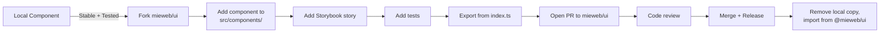
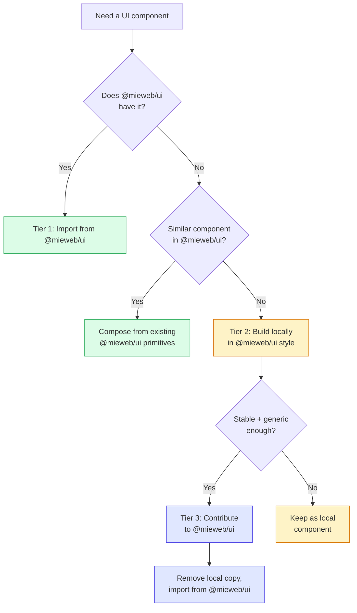

# @mieweb/ui Component Policy

> How to use, extend, and contribute components. Three tiers: use what exists, build locally when needed, contribute upstream when stable.

---

## Tier 1: Use @mieweb/ui First

**Rule: Every UI element MUST use `@mieweb/ui` if a component exists.**

Before writing any UI code, check [ui.mieweb.org](https://ui.mieweb.org) (Storybook) for an existing component. The library ships 126+ components covering:

### Primitive Components (Always Available)

| Category | Components |
|----------|------------|
| **Actions** | `Button`, `Dropdown`, `CommandPalette`, `QuickAction` |
| **Forms** | `Input`, `Textarea`, `Select`, `Checkbox`, `Radio`, `Switch`, `Slider`, `PhoneInput`, `DateInput`, `DateRangePicker`, `WebsiteInput` |
| **Data Display** | `Table` (+ TableHeader/Body/Row/Cell), `Badge`, `Avatar`, `Card` (+ CardHeader/Content), `CountBadge`, `Text`, `Timeline` |
| **Feedback** | `Alert`, `Toast`, `Spinner`, `Skeleton`, `Progress`, `LoadingPage`, `ErrorPage`, `ConnectionStatus` |
| **Navigation** | `Tabs`, `Breadcrumb`, `Pagination`, `Sidebar`, `AppHeader`, `SiteHeader`, `SiteFooter`, `PageHeader`, `StepIndicator` |
| **Overlays** | `Modal` (+ ModalHeader/Body/Footer), `Tooltip`, `DropzoneOverlay` |
| **Layout** | `ThemeProvider`, `VisuallyHidden` |
| **Media** | `AudioPlayer`, `AudioRecorder`, `RecordButton`, `DocumentScanner` |
| **Messaging** | `MessageBubble`, `MessageList`, `MessageComposer` |
| **Data Grids** | `AGGrid` (wrapper for ag-grid with theme integration) |
| **Charts** | Chart colors via `--mieweb-chart-1` through `--mieweb-chart-5` CSS variables |

### How to Import

```typescript
// Named imports from the barrel
import { Button, Input, Card, CardContent, Modal, Badge } from '@mieweb/ui';

// For brands
import { generateBrandCSS, brands } from '@mieweb/ui/brands';

// For the Tailwind 3 preset (if still on TW3)
import { miewebUIPreset } from '@mieweb/ui/tailwind-preset';
```

### What Counts as a Violation

These are **not compliant** and must be replaced:

```tsx
// ❌ Raw HTML button
<button onClick={save}>Save</button>

// ❌ Raw HTML input
<input type="text" value={name} onChange={onChange} />

// ❌ Custom modal div
<div className="fixed inset-0 bg-black/50"><div className="modal-content">...</div></div>

// ❌ Custom card container
<div className="rounded-lg border p-4 shadow">...</div>

// ❌ Custom badge span
<span className="rounded-full bg-blue-100 px-2 py-1 text-xs">Active</span>

// ❌ Raw HTML table
<table><thead><tr><th>Name</th></tr></thead></table>
```

Compliant equivalents:

```tsx
// ✅ @mieweb/ui Button
<Button onClick={save}>Save</Button>

// ✅ @mieweb/ui Input
<Input type="text" value={name} onChange={onChange} />

// ✅ @mieweb/ui Modal
<Modal open={isOpen} onClose={close}><ModalBody>...</ModalBody></Modal>

// ✅ @mieweb/ui Card
<Card><CardContent>...</CardContent></Card>

// ✅ @mieweb/ui Badge
<Badge>Active</Badge>

// ✅ @mieweb/ui Table
<Table><TableHeader><TableRow><TableCell>Name</TableCell></TableRow></TableHeader></Table>
```

---

## Tier 2: Build Locally in @mieweb/ui Style

**When no `@mieweb/ui` component exists for your need, build one locally — but build it the way `@mieweb/ui` would.**

### When to Build Locally

- The pattern is project-specific (e.g., a domain-specific dashboard widget)
- The component is experimental and the API isn't settled yet
- You need it now and can't wait for an upstream PR to merge

### Local Component Requirements

Every local component must follow these rules to be compatible with upstream contribution later:

#### 1. File Structure

```
src/components/MyWidget/
├── index.ts           # Re-exports
├── MyWidget.tsx       # Component implementation
├── MyWidget.scss      # Component-specific styles (SASS)
└── MyWidget.stories.tsx  # Storybook story (optional but encouraged)
```

#### 2. Coding Standards

```typescript
import { type VariantProps, cva } from 'class-variance-authority';
import { cn } from '@mieweb/ui'; // or your local cn utility using clsx + tailwind-merge

// Use CVA for variant management
const myWidgetVariants = cva(
  'base-classes here', // Base styles
  {
    variants: {
      variant: {
        default: 'variant-default-classes',
        outline: 'variant-outline-classes',
      },
      size: {
        sm: 'text-sm px-2 py-1',
        md: 'text-base px-3 py-2',
        lg: 'text-lg px-4 py-3',
      },
    },
    defaultVariants: {
      variant: 'default',
      size: 'md',
    },
  }
);

// Component interface extends HTML element props
interface MyWidgetProps
  extends React.HTMLAttributes<HTMLDivElement>,
    VariantProps<typeof myWidgetVariants> {
  /** Human-readable label for assistive technology */
  'aria-label'?: string;
}

// forwardRef for composability
const MyWidget = React.forwardRef<HTMLDivElement, MyWidgetProps>(
  ({ className, variant, size, ...props }, ref) => (
    <div
      ref={ref}
      className={cn(myWidgetVariants({ variant, size }), className)}
      {...props}
    />
  )
);
MyWidget.displayName = 'MyWidget';

export { MyWidget, myWidgetVariants, type MyWidgetProps };
```

#### 3. Theming Rules

- **Use `@mieweb/ui` CSS variables** for colors: `var(--mieweb-primary-500)`, `var(--mieweb-background)`, etc.
- **Use Tailwind utility classes** that map to the `@mieweb/ui` theme: `bg-primary-500`, `text-foreground`, `border-border`
- **Never hardcode colors** — no `bg-blue-500` or `#27aae1` inline
- **Support dark mode** — use `dark:` variants or rely on CSS variables that auto-switch
- **Test with brand switching** — verify the component looks right with at least 2 brands

#### 4. Accessibility Requirements

- Interactive elements must have `aria-label` or be labelled via association
- Focus must be visible (use `focus-visible:ring-2 focus-visible:ring-ring`)
- Keyboard navigation must work (Tab, Enter, Escape where appropriate)
- Use semantic HTML elements as the base (`<button>` for actions, `<input>` for input, etc.)

#### 5. i18n Requirements

- All user-facing strings must be externalizable (accept as props, not hardcoded)
- Support RTL layouts via logical properties (`ps-4` not `pl-4`, `me-2` not `mr-2`)

---

## Tier 3: Contribute Upstream to @mieweb/ui

**When a local component is stable, well-tested, and useful beyond your project, contribute it to `@mieweb/ui`.**

### Contribution Criteria

A component is ready for upstream contribution when:

- [ ] **Used in production** — it's been running in at least one real project
- [ ] **API is stable** — the props interface hasn't changed significantly in 2+ weeks
- [ ] **Follows Tier 2 standards** — CVA variants, forwardRef, CN utility, theme variables
- [ ] **Has accessibility** — ARIA labels, keyboard nav, focus indicators
- [ ] **Has dark mode support** — tested with light and dark themes
- [ ] **Has brand support** — tested with at least 2 brands
- [ ] **Has a Storybook story** — demonstrates all variants and states
- [ ] **Has tests** — at minimum, a render test and interaction test
- [ ] **Is generic** — no project-specific business logic baked in

### Contribution Process



#### Step-by-Step

1. **Fork** `mieweb/ui` and create a feature branch: `feat/my-widget`

2. **Copy** your local component into `src/components/MyWidget/`:
   ```
   src/components/MyWidget/
   ├── index.ts
   ├── MyWidget.tsx
   ├── MyWidget.scss
   ├── MyWidget.stories.tsx
   └── MyWidget.test.tsx
   ```

3. **Export** from the barrel `src/index.ts`:
   ```typescript
   export { MyWidget, type MyWidgetProps } from './components/MyWidget';
   ```

4. **Write a Storybook story** covering all variants, sizes, and states (default, hover, focus, disabled, dark mode)

5. **Write tests**:
   ```typescript
   import { render, screen } from '@testing-library/react';
   import { MyWidget } from './MyWidget';

   test('renders with default variant', () => {
     render(<MyWidget>Content</MyWidget>);
     expect(screen.getByText('Content')).toBeInTheDocument();
   });
   ```

6. **Open a PR** to `mieweb/ui:main` with:
   - Description of the component's purpose
   - Screenshot of light and dark mode
   - Link to Storybook story (if deployed)

7. **After merge and release**, update your project:
   ```bash
   npm update @mieweb/ui
   ```
   Then delete the local copy and change imports to `from '@mieweb/ui'`.

### What NOT to Contribute

- Components with project-specific business logic
- Components that wrap a single `@mieweb/ui` component with minor prop changes (use composition instead)
- Components that duplicate existing `@mieweb/ui` functionality
- Untested or experimental components

---

## Decision Flowchart



---

## Summary

| Tier | When | What |
|------|------|------|
| **1. Use** | Component exists in `@mieweb/ui` | `import { X } from '@mieweb/ui'` |
| **2. Build** | No equivalent exists yet | Build locally following @mieweb/ui patterns (CVA, forwardRef, theme vars, a11y) |
| **3. Contribute** | Local component is stable + generic | PR to `mieweb/ui`, then replace local with import |
