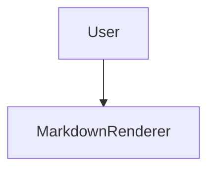

# MarkdownRenderer

Renders markdown to React with rich fenced-code block support. Fenced blocks with special language tags (`csv`, `mermaid`, `survey`, `html`) are replaced by interactive React components; all other code blocks get syntax highlighting via highlight.js.

## Installation

```bash
# peer deps — only install what you use
pnpm add mermaid       # mermaid diagrams
pnpm add papaparse     # csv blocks
pnpm add js-yaml       # survey blocks
```

Import the stylesheet once in your app entry (or Storybook's `preview.ts`):

```ts
import '@mieweb/ui/markdown.css';
```

## Basic usage

```tsx
import { MarkdownRenderer } from '@mieweb/ui';

<MarkdownRenderer text={markdownString} />;
```

## Props

| Prop        | Type      | Default | Description                                             |
| ----------- | --------- | ------- | ------------------------------------------------------- |
| `text`      | `string`  | —       | Raw markdown source                                     |
| `cacheKey`  | `string`  | —       | Stable key for render caching (e.g. `message._id`)      |
| `className` | `string`  | `''`    | Extra CSS classes on the root element                   |
| `streaming` | `boolean` | `false` | Use synchronous rendering for token-by-token AI streams |

### `streaming` prop

When `true`, each render is synchronous so new tokens appear immediately without waiting for lazy language imports. Switch back to `false` once the stream completes to trigger a final async render with full syntax highlighting.

```tsx
// While streaming
<MarkdownRenderer text={partialText} cacheKey={msgId} streaming />

// After stream ends
<MarkdownRenderer text={finalText} cacheKey={msgId} />
```

## Special fence languages

### `mermaid` — diagrams

````md

````

Requires `mermaid` as a peer dependency. Diagrams re-render automatically when the page theme changes (dark ↔ light).

### `csv` — sortable table

````md
```csv
Name,Age,Role
Alice,32,Engineer
Bob,28,Designer
```
````

Requires `papaparse` as a peer dependency. Includes column sorting and CSV export.

### `survey` — form fields

````md
```survey
{
  "elements": [
    { "type": "text", "name": "name", "title": "Full Name" },
    { "type": "radiogroup", "name": "exp", "title": "Experience", "choices": ["0-1", "2-5", "5+"] }
  ]
}
```
````

Requires `js-yaml` as a peer dependency.

### `html` — sandboxed preview

````md
```html
<h1>Hello</h1>
<button onclick="alert('hi')">Click me</button>
```
````

Rendered in a sandboxed iframe (`allow-scripts allow-forms`). Toggle between Preview and Code views in the block header.

## Security

- All HTML output is sanitised with **DOMPurify** before rendering.
- Anchor tags get `target="_blank" rel="noopener noreferrer"` automatically.
- Block markers include a sentinel attribute (`data-md-fence="1"`) so raw HTML injected into markdown cannot spoof special blocks.
- `javascript:` URLs and event handler attributes are stripped.
